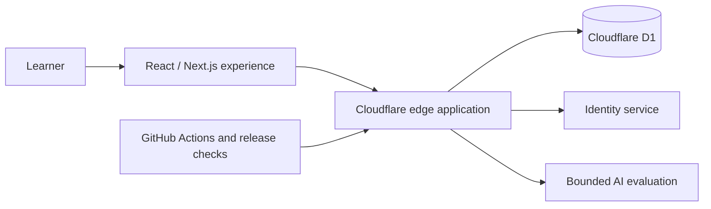

# ProofAnvil — Engineering Case Study

[Visit ProofAnvil](https://proofanvil.com)

ProofAnvil is a web platform for deliberate mathematics practice. I founded the project and lead its product direction, software architecture, implementation workflow, testing, and release verification.

> The application source is private. This repository documents the public product and the engineering approach without exposing learner data, private infrastructure, operational credentials, or internal release records.

## The problem

Serious mathematics practice needs more than an answer box. Learners need structured practice, useful feedback, durable progress, and a truthful distinction between independent work and work completed with assistance. The software also has to preserve privacy and correctness while remaining responsive enough to support daily study.

## What the product provides

- course and problem-library browsing;
- structured training and study-plan workflows;
- learner progress and statistics surfaces;
- authenticated account and membership experiences;
- mathematics rendering and AI-assisted evaluation within bounded workflows.

The product is under active development. This case study describes implemented or publicly observable surfaces and does not claim unverified customer, payment, or revenue outcomes.

## My role

As founder and product engineer, I:

- translate learner and curriculum needs into product and system requirements;
- design the application architecture and privacy/correctness boundaries;
- work across the TypeScript application, data layer, tests, and release tooling;
- direct AI-assisted engineering through bounded work packets and independent review;
- distinguish authored, tested, merged, deployed, and live-verified states rather than treating activity as delivery.

## High-level architecture

This diagram is intentionally high level. It communicates technology boundaries without publishing private endpoints, credentials, deployment identifiers, or internal control-plane details.

## Technology

- TypeScript, React, and Next.js
- Cloudflare Workers and D1
- Drizzle ORM and SQL
- Tailwind CSS and KaTeX
- OpenAI APIs for bounded evaluation workflows
- GitHub Actions, automated tests, and staged release checks

## Engineering principles

### Correctness before claims

A local change is not the same thing as a reviewed or live result. The delivery workflow keeps implementation, review, deployment, and external verification separate.

### Privacy-aware learner evidence

Private answer material and evaluation logic remain server-side. Learner-facing data is deliberately narrower than authoring and review data.

### Assistance should be truthful

The product distinguishes independent work from supported work so feedback and progress remain meaningful instead of rewarding hidden assistance.

### AI with bounded authority

AI-assisted development is organized around scoped work, explicit non-goals, reproducible checks, and independent review. The goal is reliable delivery, not maximum generated-code volume.

### Recovery is a feature

Versioning, deterministic checks, and explicit release evidence make failures diagnosable and changes recoverable.

## Current focus

Current work prioritizes learner responsiveness, structured proof practice, content quality, privacy, and release reliability.

## Links

- [ProofAnvil](https://proofanvil.com)
- [Martin Piceno on GitHub](https://github.com/LostandAdrift)
- [Martin Piceno on LinkedIn](https://www.linkedin.com/in/martin-piceno-47b814172)
